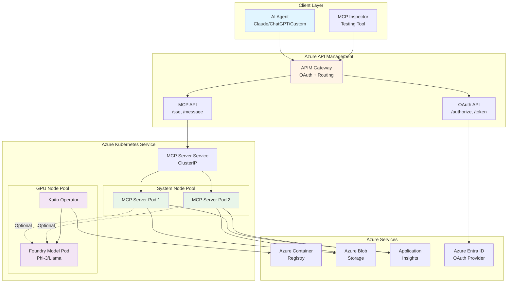
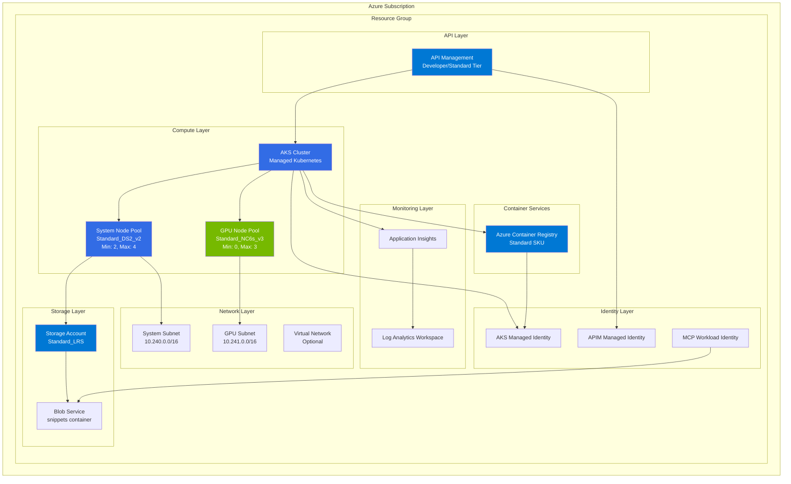
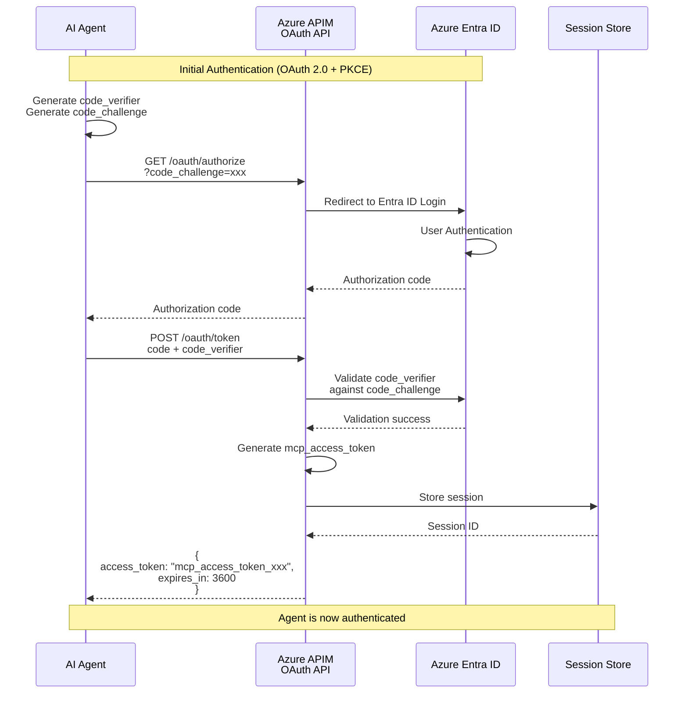
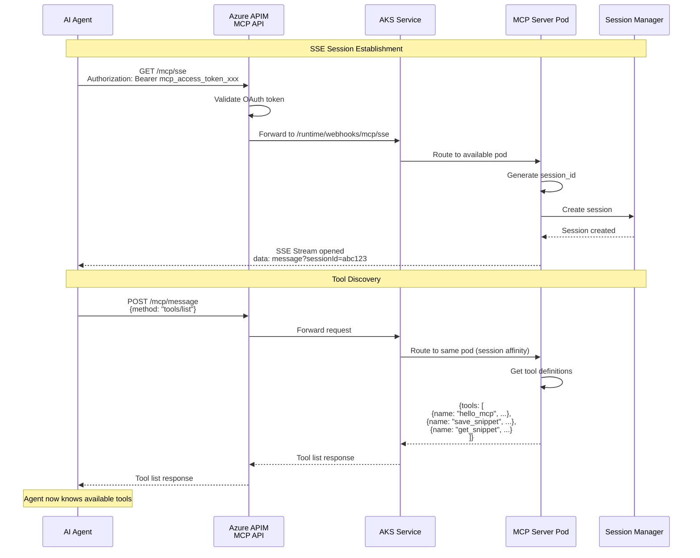
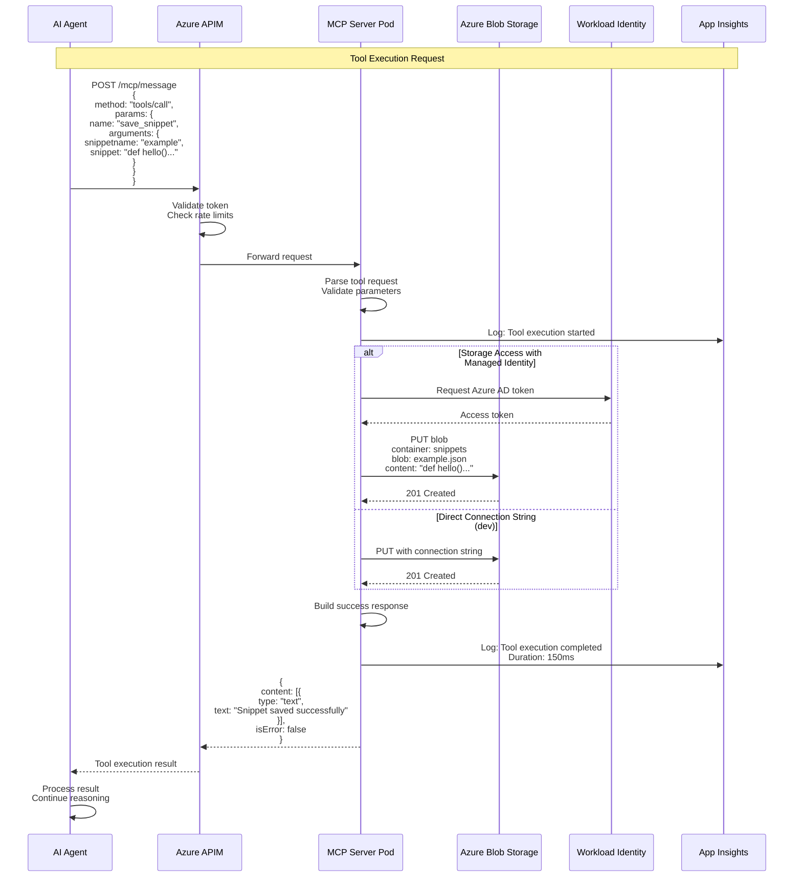
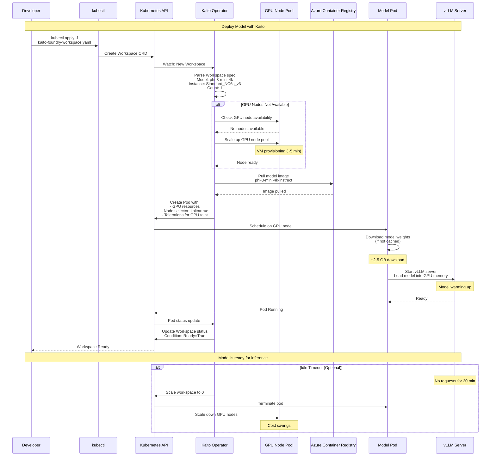
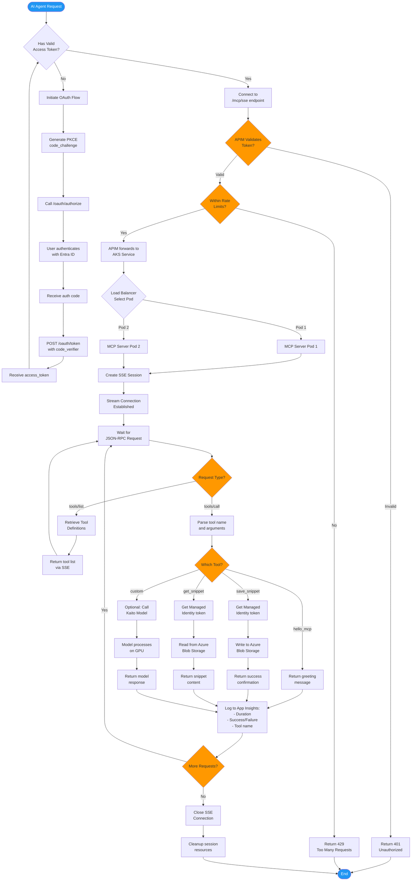
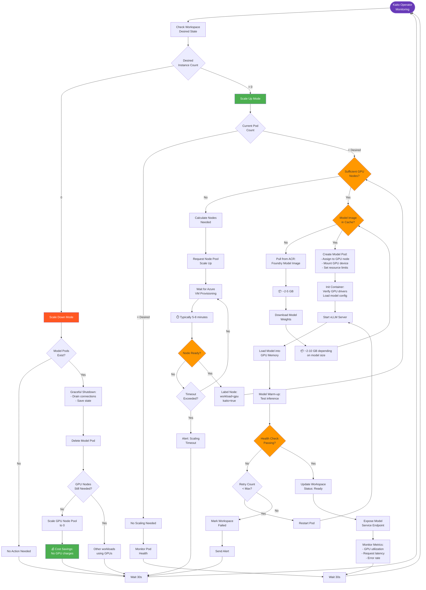

# System Architecture Diagrams

This document provides comprehensive Mermaid diagrams for the AI Agents with AKS, Kaito, and APIM solution.

## Table of Contents

1. [Component Architecture Diagram](#component-architecture-diagram)
2. [Detailed Component Diagram](#detailed-component-diagram)
3. [Deployment Architecture](#deployment-architecture)
4. [Sequence Diagrams](#sequence-diagrams)
   - [Agent Authentication Flow](#agent-authentication-flow)
   - [MCP Tool Discovery](#mcp-tool-discovery)
   - [MCP Tool Execution](#mcp-tool-execution)
   - [Model Inference with Kaito](#model-inference-with-kaito)
5. [Activity Diagrams](#activity-diagrams)
   - [Deployment Process](#deployment-process-activity-diagram)
   - [Request Processing](#request-processing-activity-diagram)
   - [Kaito Model Scaling](#kaito-model-scaling-activity-diagram)

---

## Component Architecture Diagram

High-level component view of the entire system:



---

## Detailed Component Diagram

Detailed view showing all components, their responsibilities, and interactions:

```mermaid
graph TB
    subgraph "AI Agent Client"
        AgentCore[Agent Core Engine]
        MCPClient[MCP Client Library]
        AgentCore --> MCPClient
    end

    subgraph "Azure API Management Layer"
        subgraph "OAuth Components"
            AuthEndpoint[/authorize Endpoint]
            TokenEndpoint[/token Endpoint]
            RegisterEndpoint[/register Endpoint]
            WellKnown[/.well-known<br/>OAuth Metadata]
        end
        
        subgraph "MCP Components"
            SSEEndpoint[/sse Endpoint<br/>Server-Sent Events]
            MessageEndpoint[/message Endpoint<br/>JSON-RPC 2.0]
        end
        
        subgraph "APIM Policies"
            AuthPolicy[Authentication Policy<br/>OAuth Token Validation]
            RateLimitPolicy[Rate Limiting Policy]
            CORSPolicy[CORS Policy]
            BackendPolicy[Backend Routing Policy]
        end
    end

    subgraph "AKS Cluster - System Node Pool"
        subgraph "MCP Server Deployment"
            subgraph "Pod 1"
                FastAPI1[FastAPI App]
                SSEHandler1[SSE Handler<br/>Async Streaming]
                MCPTools1[MCP Tool Executor<br/>hello, get, save]
                StorageClient1[Azure Storage SDK]
            end
            
            subgraph "Pod 2"
                FastAPI2[FastAPI App]
                SSEHandler2[SSE Handler]
                MCPTools2[MCP Tool Executor]
                StorageClient2[Azure Storage SDK]
            end
        end
        
        K8sService[Kubernetes Service<br/>Load Balancer]
        ServiceAccount[Service Account<br/>Workload Identity]
    end

    subgraph "AKS Cluster - GPU Node Pool"
        subgraph "Kaito Components"
            KaitoController[Kaito Controller<br/>Workspace Manager]
            KaitoCRD[Workspace CRD<br/>Custom Resource]
        end
        
        subgraph "Model Inference"
            ModelServer[vLLM/TGI Server<br/>Model Serving]
            GPUResources[NVIDIA GPU<br/>NC-Series VM]
            ModelCache[Model Weights<br/>Cached Locally]
        end
    end

    subgraph "Azure Container Registry"
        MCPImage[MCP Server Image<br/>mcp-server:latest]
        FoundryImage[Foundry Model Image<br/>phi-3-mini-4k]
    end

    subgraph "Azure Storage"
        SnippetsContainer[snippets Container<br/>Blob Storage]
        DeploymentContainer[deployment Container<br/>Code Packages]
    end

    subgraph "Monitoring & Identity"
        AppInsightsSDK[App Insights SDK<br/>Telemetry]
        ManagedIdentity[Managed Identity<br/>AAD Integration]
        LogAnalytics[Log Analytics<br/>Workspace]
    end

    MCPClient --> SSEEndpoint
    MCPClient --> MessageEndpoint
    SSEEndpoint --> AuthPolicy
    MessageEndpoint --> AuthPolicy
    AuthPolicy --> RateLimitPolicy
    RateLimitPolicy --> BackendPolicy
    BackendPolicy --> K8sService
    
    K8sService --> FastAPI1
    K8sService --> FastAPI2
    
    FastAPI1 --> SSEHandler1
    FastAPI1 --> MCPTools1
    MCPTools1 --> StorageClient1
    StorageClient1 --> SnippetsContainer
    
    FastAPI2 --> SSEHandler2
    FastAPI2 --> MCPTools2
    MCPTools2 --> StorageClient2
    StorageClient2 --> SnippetsContainer
    
    ServiceAccount --> ManagedIdentity
    ManagedIdentity --> SnippetsContainer
    
    KaitoController --> KaitoCRD
    KaitoCRD --> ModelServer
    ModelServer --> GPUResources
    ModelServer --> ModelCache
    
    KaitoController --> ACR
    ACR --> FoundryImage
    ACR --> MCPImage
    
    FastAPI1 --> AppInsightsSDK
    FastAPI2 --> AppInsightsSDK
    AppInsightsSDK --> LogAnalytics
    
    AuthEndpoint --> ManagedIdentity

    style AgentCore fill:#e1f5ff
    style APIM fill:#fff4e6
    style FastAPI1 fill:#e8f5e9
    style FastAPI2 fill:#e8f5e9
    style ModelServer fill:#f3e5f5
    style GPUResources fill:#ffebee
```

---

## Deployment Architecture

Infrastructure and deployment view:



---

## Sequence Diagrams

### Agent Authentication Flow

OAuth 2.0 PKCE flow for AI agent authentication:



### MCP Tool Discovery

AI agent discovers available tools:



### MCP Tool Execution

AI agent executes a tool (save_snippet example):



### Model Inference with Kaito

How Kaito manages and scales AI models:



---

## Activity Diagrams

### Deployment Process Activity Diagram

Complete deployment workflow:

```mermaid
flowchart TD
    Start([Start Deployment]) --> PreReq{Prerequisites<br/>Installed?}
    
    PreReq -->|No| InstallTools[Install:<br/>- Azure CLI<br/>- azd<br/>- kubectl<br/>- helm<br/>- Docker]
    InstallTools --> PreReq
    
    PreReq -->|Yes| AzdInit[Run: azd init]
    AzdInit --> SetEnv[Select/Create<br/>Environment]
    SetEnv --> AzdUp[Run: azd up]
    
    AzdUp --> ProvInfra{Infrastructure<br/>Provision Success?}
    
    ProvInfra -->|No| CheckErrors[Check Errors:<br/>- Quota limits<br/>- Region availability<br/>- Permissions]
    CheckErrors --> AzdUp
    
    ProvInfra -->|Yes| InfraReady[Infrastructure Ready:<br/>✓ AKS Cluster<br/>✓ ACR<br/>✓ APIM<br/>✓ Storage<br/>✓ Monitoring]
    
    InfraReady --> GetCreds[azd post-provision:<br/>Get AKS credentials]
    GetCreds --> InstallKaito[Run:<br/>./scripts/install-kaito.sh]
    
    InstallKaito --> KaitoCheck{Kaito Operator<br/>Running?}
    
    KaitoCheck -->|No| WaitKaito[Wait 30s<br/>Check pods]
    WaitKaito --> KaitoCheck
    
    KaitoCheck -->|Yes| BuildImage[Run:<br/>./scripts/build-and-push.sh]
    BuildImage --> ImagePush[Push to ACR]
    
    ImagePush --> DeployMCP[kubectl apply:<br/>mcp-server-deployment.yaml]
    DeployMCP --> MCPCheck{MCP Server<br/>Pods Ready?}
    
    MCPCheck -->|No| WaitMCP[Wait for pods<br/>Check logs]
    WaitMCP --> MCPCheck
    
    MCPCheck -->|Yes| DeployModel[kubectl apply:<br/>kaito-foundry-workspace.yaml]
    
    DeployModel --> GPUScale{GPU Nodes<br/>Available?}
    
    GPUScale -->|No| ScaleGPU[Kaito scales up<br/>GPU node pool]
    ScaleGPU --> WaitGPU[Wait 5-10 min<br/>for VM provisioning]
    WaitGPU --> GPUScale
    
    GPUScale -->|Yes| ModelDeploy[Kaito deploys<br/>Foundry model pod]
    
    ModelDeploy --> ModelReady{Model Pod<br/>Ready?}
    
    ModelReady -->|No| CheckModel[Check:<br/>- Image pull<br/>- GPU allocation<br/>- Model download]
    CheckModel --> ModelReady
    
    ModelReady -->|Yes| RunTests[Run Tests:<br/>- test_kaito_deployment.py<br/>- test_mcp_fixed_session.py]
    
    RunTests --> TestsPass{All Tests<br/>Pass?}
    
    TestsPass -->|No| Debug[Debug Issues:<br/>- Check logs<br/>- Verify connectivity<br/>- Check auth]
    Debug --> RunTests
    
    TestsPass -->|Yes| Complete([Deployment Complete<br/>System Ready])
    
    style Start fill:#4caf50,color:#fff
    style Complete fill:#4caf50,color:#fff
    style PreReq fill:#ff9800
    style ProvInfra fill:#ff9800
    style KaitoCheck fill:#ff9800
    style MCPCheck fill:#ff9800
    style GPUScale fill:#ff9800
    style ModelReady fill:#ff9800
    style TestsPass fill:#ff9800
```



### Request Processing Activity Diagram

How a request flows through the system:



### Kaito Model Scaling Activity Diagram

Auto-scaling behavior for GPU resources:



---

## Legend

### Component Diagram Shapes

- **Rectangle**: Component or Service
- **Cylinder**: Database or Storage
- **Hexagon**: External Service
- **Diamond**: Decision Point
- **Rounded Rectangle**: Process or Function

### Sequence Diagram Notation

- **Solid Line →**: Synchronous Call
- **Dashed Line ⇢**: Response
- **Note**: Additional Information
- **Alt/Else**: Alternative Paths

### Activity Diagram Symbols

- **Rounded Rectangle**: Activity/Process
- **Diamond**: Decision Point
- **Circle**: Start/End Point
- **Rectangle**: Subprocess

---

## Viewing These Diagrams

These Mermaid diagrams can be rendered in:

1. **GitHub/GitLab**: Automatically renders in markdown files
2. **VS Code**: Install "Markdown Preview Mermaid Support" extension
3. **Mermaid Live Editor**: https://mermaid.live
4. **Documentation Sites**: Most support Mermaid natively

---

## Additional Resources

- [Mermaid Documentation](https://mermaid.js.org/)
- [Architecture Decision Records](./docs/adr/)
- [Deployment Guide](./README.md)
- [Migration Guide](./MIGRATION.md)
